# Synthetic Notice Generator — Program Structure

This diagram maps the structure and data flow of [`synthetic_notice_generator.py`](./synthetic_notice_generator.py). The generator is deterministic and self-contained: it uses only its authored templates and lexicons and never reads OCR artifacts.

```mermaid
flowchart TD
    CLI["Command line<br/>main(argv)"] --> PARSER["_build_parser()<br/>output directory, seed,<br/>families per template, force"]
    PARSER --> CONFIG["GeneratorConfig<br/>seed · family count · split percentages<br/>generator version"]
    CONFIG --> WRITE["write_corpus(output_dir, config, overwrite)"]

    subgraph GENERATION["1. Deterministic record generation"]
        GEN["generate_records(config)"] --> VALIDATE["config.validate()"]
        VALIDATE --> LOOPS["Loop over 8 templates<br/>× configured families"]
        LOOPS --> IDS["Create group_id and group_index"]
        IDS --> FACTS["_make_facts()<br/>stable per-group RNG"]

        LEXICONS["Authored constants<br/>names · surnames · towns · occupations<br/>titles · months · weekdays"] --> FACTS
        SEED["_stable_seed()<br/>SHA-256-derived integer"] --> FACTS
        FACTS --> NOTICE_FACTS["_NoticeFacts<br/>fictional identity, dates,<br/>relatives, ceremony details"]

        NOTICE_FACTS --> RENDER["_render_notice()<br/>select one of 8 notice layouts"]
        RENDER --> HELPERS["Formatting helpers<br/>_name_block() · _format_date()<br/>_ceremony()"]
        HELPERS --> CLEAN["Clean notice text"]
        CLEAN --> SEMANTIC["_semantic_slices()<br/>date · relationship · ceremony<br/>optional title/name/occupation/umlaut"]

        IDS --> SPLIT["assign_split()<br/>SHA-256 bucket of seed + group_id<br/>whole family stays in one subset"]
        CONFIG --> SPLIT
        SPLIT --> SUBSET["train / validation / test"]

        CLEAN --> VARIANTS["Loop over variants<br/>clean · light · heavy"]
        IDS --> VARIANTS
        VARIANTS --> CORRUPT["_corrupt()<br/>0, 1, or 3 deterministic corruptions"]
        CORRUPT --> APPLY["apply_ocr_corruption()"]
        APPLY --> OCR["OCR operations<br/>rn↔m · 1↔l · drop punctuation<br/>merge spaces · break umlaut"]
        OCR --> VARIANT_TEXT["Variant text + OCR slice labels"]

        SEMANTIC --> RECORD["NoticeRecord<br/>document_id · group_id · split · text<br/>slices · privacy · generator version"]
        SUBSET --> RECORD
        VARIANT_TEXT --> RECORD
        RECORD --> SORTED["Tuple sorted by document_id"]
    end

    SORTED --> MANIFEST["build_manifest(records, config)"]

    subgraph VALIDATION["2. Validation and manifest construction"]
        MANIFEST --> INVARIANTS["Validate invariants<br/>unique IDs · known/nonempty splits<br/>synthetic provenance · matching version<br/>no group leakage"]
        INVARIANTS --> VOCAB["Build training-only vocabulary<br/>BOS, EOS, then sorted characters<br/>verify evaluation character coverage"]
        VOCAB --> COUNTS["Aggregate document, character,<br/>subset, and slice counts"]
        COUNTS --> SERIALIZE["serialize_records()<br/>canonical, sorted JSON Lines"]
        SERIALIZE --> HASH["SHA-256 corpus fingerprint"]
        HASH --> MANIFEST_DATA["Manifest dictionary<br/>configuration · split rule · counts<br/>vocabulary · fingerprint · privacy"]
    end

    SORTED --> SERIALIZE
    SERIALIZE --> CORPUS_BYTES["corpus.jsonl bytes"]
    MANIFEST_DATA --> MANIFEST_BYTES["formatted manifest.json bytes"]

    subgraph OUTPUT["3. Safe output"]
        CORPUS_BYTES --> ATOMIC["_atomic_write()<br/>temporary file + os.replace()"]
        MANIFEST_BYTES --> ATOMIC
        ATOMIC --> FILES["learning/data or requested directory<br/>corpus.jsonl + manifest.json"]
    end

    WRITE --> EXISTS{"Output exists<br/>without --force?"}
    EXISTS -- "yes" --> ERROR["FileExistsError → CLI status 2"]
    EXISTS -- "no / overwrite" --> GEN
    FILES --> SUCCESS["Summary with document count<br/>and SHA-256 → CLI status 0"]

    subgraph EVENTS["4. Public training-event helpers"]
        RECORDS_IN["Iterable of NoticeRecord"] --> CORPUS_EVENTS["iter_corpus_bigram_events()"]
        CORPUS_EVENTS --> DOC_EVENTS["iter_bigram_events(text)<br/>reset at every document"]
        DOC_EVENTS --> EVENT_STREAM["document_id, input, target<br/>BOS → first char → … → EOS"]
    end

    SORTED -. "can feed" .-> RECORDS_IN
```

The default configuration produces `8 templates × 50 families × 3 variants = 1,200 documents`. A family and all three of its variants share one `group_id` and therefore one dataset split, preventing near-duplicate leakage between training, validation, and test data.
